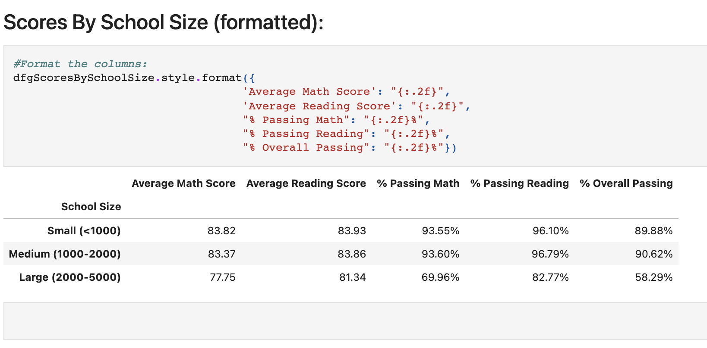

# Pandas_School_Analysis
Using Jupyter Notebook and Pandas. Reviewing schools for data analysis.

More Python coding. 

Analyzing city school data to make future school budget decisions. 

### Setup

* Inside the local git repository, created a folder for the Python/Pandas Challenge. 
   **CitySchools** 
   
*  The analysis can be seen in the files: 'School Data Analysis.RTF' or 'School Data Analysis.DOCX'

* Inside of this folder 'CitySchools'; added the following:

  * A new file called `CitySchools.ipynb`. This is the main script to run for analysis.
  * A "Resources" folder that contains the CSV files used. Make sure the script has the correct path to the CSV file.

### District Summary
* A table that summarizes key metrics about each school, including:
* Total Schools
* Total Students
* Total Budget
* Average Math Score
* Average Reading Score
* % Passing Math (The percentage of students that passed math.)
* % Passing Reading (The percentage of students that passed reading.)
* % Overall Passing (The percentage of students that passed math **and** reading.)

### School Summary
* A table that highlights the top 5 performing schools based on % Overall Passing. Include:
* School Name
* School Type
* Total Students
* Total School Budget
* Per Student Budget
* Average Math Score
* Average Reading Score
* % Passing Math (The percentage of students that passed math.)
* % Passing Reading (The percentage of students that passed reading.)
* % Overall Passing (The percentage of students that passed math **and** reading.)

### Bottom Performing Schools (By % Overall Passing)

* A table that highlights the bottom 5 performing schools based on % Overall Passing. Include all of the same metrics as above.

### Math Scores by Grade

* A table that lists the average Math Score for students of each grade level (9th, 10th, 11th, 12th) at each school.

### Reading Scores by Grade

* A table that lists the average Reading Score for students of each grade level (9th, 10th, 11th, 12th) at each school.

### Scores by School Spending

* A table that breaks down school performances based on average Spending Ranges (Per Student). Use 4 reasonable bins to group school spending. Include in the table each of the following:
  * Average Math Score
  * Average Reading Score
  * % Passing Math (The percentage of students that passed math.)
  * % Passing Reading (The percentage of students that passed reading.)
  * % Overall Passing (The percentage of students that passed math **and** reading.)

### Scores by School Size

* Repeated the above breakdown, but this time grouped schools based on a reasonable approximation of school size (Small, Medium, Large).

### Scores by School Type

* Repeated the above breakdown, but this time group schools based on school type (Charter vs. District).

## References

Mockaroo, LLC. (2021). Realistic Data Generator. [https://www.mockaroo.com/](https://www.mockaroo.com/)

- - -

© 2021 Trilogy Education Services, LLC, a 2U, Inc. brand. Confidential and Proprietary. All Rights Reserved.
